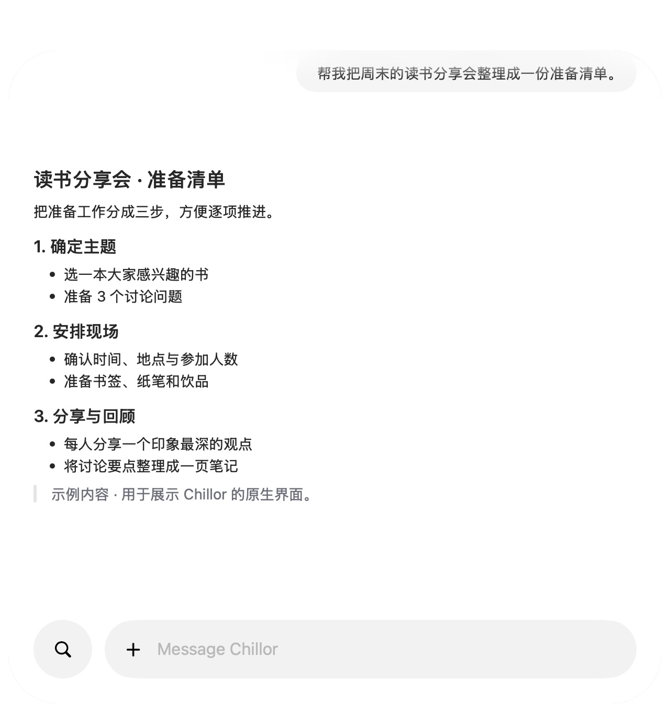
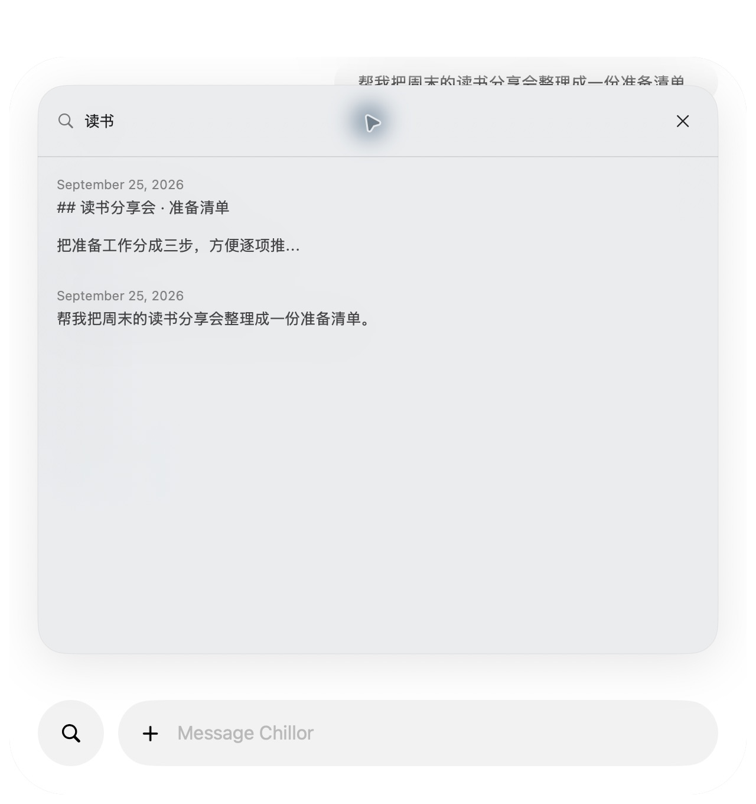

# Chillor

**English · [简体中文](README.zh-CN.md)**

A local-first AI assistant for macOS. Express what you want to accomplish; Chillor manages conversation context, task workspaces, tools, and memory.

**Early preview, under active development.** Local inference uses Ollama and Qwen. An optional DeepSeek provider is available in Settings; selecting it sends inference context to that provider. There is no automatic local-to-cloud fallback.

## Interface preview

### Keep your work in one conversation



### Find earlier context



These are real macOS screenshots of the current source build, populated with synthetic demo content. They contain no personal conversation data and illustrate the interface, not a live model run or latency benchmark.

## What is implemented

- Native SwiftUI/AppKit interface with streaming replies, searchable history, file previews, and configurable Reply/Translate shortcuts.
- OpenAI Agents SDK `Runner` and `SQLiteSession`, with a custom local Ollama model adapter. Local mode needs no OpenAI API key.
- Multi-step tool execution over MCP stdio, on-demand tool discovery, recoverable tool errors, and task-local artifacts.
- File search/read/write, public-web research, and Word, spreadsheet, and presentation creation/editing.
- Bounded context assembly, history retrieval, and local personal memory.
- Optional sandboxed Python execution, exposed only after runtime isolation checks pass. It has no network access.

**Not implemented:** automatic installation of arbitrary capabilities, general third-party MCP configuration, or a dedicated X/Twitter video downloader. Model/tool reliability varies; inspect important outputs.

## Requirements

- Apple Silicon Mac; the package declares macOS 15 minimum. The development UI has primarily been exercised on macOS 26.
- Xcode Command Line Tools with Swift 6 or newer.
- A relocatable CPython 3.12 distribution and a macOS ARM64 Ollama runtime. Neither runtime nor model weights is stored in this repository.
- Enough memory and disk space for your chosen local model. First launch offers model setup; model availability depends on the configured Ollama service.

## Build from source

```sh
git clone https://github.com/cellier/Chillor.git
cd Chillor
# Use extracted, trusted runtime distributions; see docs/public/BUILDING.md.
export CHILLOR_PYTHON_SOURCE="/absolute/path/to/relocatable-python"
export CHILLOR_MODEL_RUNTIME_SOURCE="/absolute/path/to/ollama-runtime"
./scripts/setup-agent-runtime.sh
./scripts/setup-model-runtime.sh
./scripts/build.sh
open outputs/Chillor.app
```

See [build and packaging details](docs/public/BUILDING.md) and [current validation / toolchain limitations](docs/public/VALIDATION.md). The resulting application is ad hoc signed unless `CHILLOR_SIGNING_IDENTITY` is set. Developer ID signing and Apple notarization are not provided by the default build.

## Architecture and privacy

```text
SwiftUI / AppKit
  → task routing and context assembly
  → Python OpenAI Agents SDK Runner + local SQLite sessions
  → Ollama (local default) / DeepSeek (explicit opt-in)
  → MCP workspace tools / guarded Python execution
  → local artifacts, history and memory
```

Local model traffic uses `127.0.0.1:11440`. Web tools still contact websites, model setup downloads weights, and optional DeepSeek inference sends relevant messages, context and tool results to its service. “Local-first” does not mean every feature is offline.

Conversation and task data live under `~/Library/Application Support/Chillor`; preferences use `com.chillor.mac`. DeepSeek keys are stored in macOS Keychain. Existing legacy ReplyLens model storage may be reused. Screen capture and desktop actions require applicable macOS permissions.

Read [security boundaries](SECURITY.md) before enabling code execution or desktop actions. The app is a preview, not an audited security boundary for hostile workloads.

## Tests

```sh
Resources/AgentPython/bin/python3 scripts/test-python.py
# Runtime isolation probe: requires macOS; a failure must keep execution unavailable.
Resources/AgentPython/bin/python3 Resources/AgentTools/sandbox.py
```

Tests named `*live_eval.py` are separate, optional integration checks. They may start local inference, use the network, or consume paid provider quota; review them before running. Native UI checks require an unlocked macOS session. See [CONTRIBUTING.md](CONTRIBUTING.md).

## License

Chillor-authored code is MIT licensed. Vendored code retains its own licenses; see [THIRD_PARTY_NOTICES.md](THIRD_PARTY_NOTICES.md). Model weights and runtime distributions are separate downloads under their respective terms.
